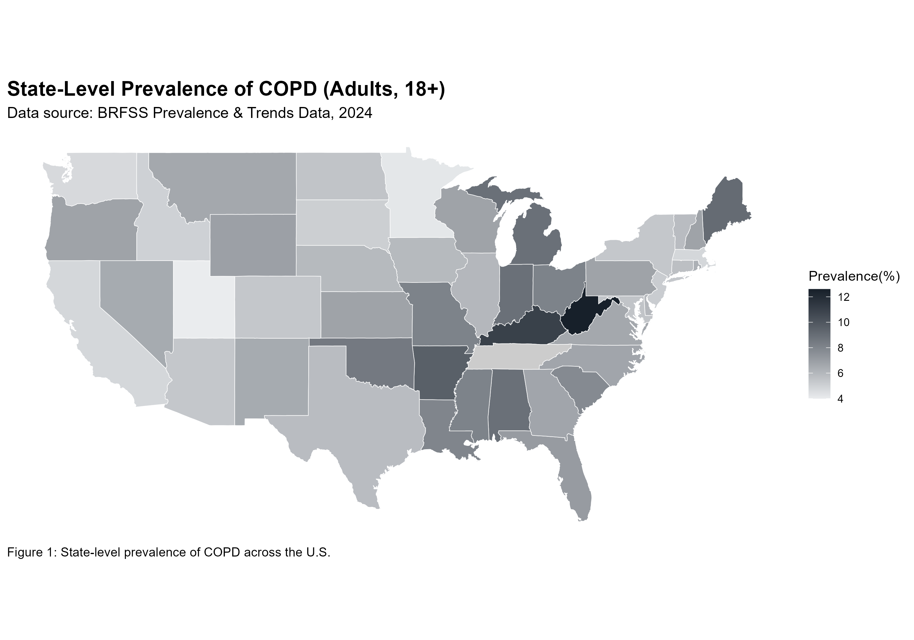

# **U.S. State-Level COPD Choropleth Map**

---

## Author

nikcompsci

https://github.com/nikcompsci/

---

## **Project Purpose:**  

Visualize state-level COPD prevalence in the U.S. using R and CDC BRFSS data (adults 18+).

---

## Visualization

  

**Figure:** COPD prevalence is highest in the Southeastern U.S., based on CDC BRFSS data for adults 18+.

The choropleth map was created using `ggplot2` and `geom_sf()`, with color gradients reflecting increasing COPD prevalence.

**Key R Packages Used:**  

- `tidyverse` – data manipulation and cleaning  

- `sf` – spatial data handling  

- `ggplot2` – data visualization  

- `maps` – U.S. state boundary data  

- `here` – reproducible file paths

  

------

## Data Source

### Centers for Disease Control and Prevention (CDC)

**Behavioral Risk Factor Surveillance System (BRFSS): Prevalence & Trends Data, Chronic Health Indicators: COPD, Adults 18+** 
Prevalence & Trends Data, Adults 18+
[https://www.cdc.gov/brfss/brfssprevalence/index.html](https://www.cdc.gov/brfss/brfssprevalence/index.html)

> **The dataset contains state-level prevalence percentages for adults reporting a diagnosis of Chronic Obstructive Pulmonary Disease (COPD).**

> Note: The source table was manually reviewed and cleaned prior to analysis. A spelling inconsistency in the prevalence column name was corrected to ensure accurate merging and visualization.

---

## Project Structure

US_COPD_Choropleth_Project/
│
├── R/
│   └── COPD_Prevalence.R
│
├── data/
│   └── copd_state_prevalence.csv
│
├── figures/
│   └── copd_map.png
│
├── US_COPD_Choropleth_Project.Rproj
└── README.md

---

## Reproducibility

To reproduce this analysis:  
1. Open the R project file (.Rproj)  
2. Ensure required packages are installed  
3. Run the script: `COPD_Prevalence.R`  
> All file paths are handled using `here()` for cross-system compatibility.

---

## Disclaimer

This project is for educational and portfolio purposes only. The analysis does not represent official CDC interpretations or conclusions.

---

## References

1. Centers for Disease Control and Prevention, National Center for Chronic Disease Prevention and Health Promotion, Division of Population Health. BRFSS Prevalence & Trends Data [online]. 2025. [accessed Thu, 18 Dec 2025 05:16:46 GMT]. URL: [https://www.cdc.gov/brfss/brfssprevalence/.](https://www.cdc.gov/brfss/brfssprevalence/)
   
2. Becker, R. A., Wilks, A. R., Brownrigg, R., Minka, T. P., & Deckmyn, A. (2018).  
   *maps: Draw Geographical Maps*. R package.  
   [https://cran.r-project.org/web/packages/maps/index.html](https://cran.r-project.org/web/packages/maps/index.html)

3. Pebesma, E. (2018).  
   *sf: Simple Features for R*. R package.  
   [https://cran.r-project.org/package=sf](https://cran.r-project.org/web/packages/sf/index.html)

4. Wickham, H. et al. (2019).  
   *Welcome to the tidyverse*. Journal of Open Source Software.  
   [https://www.tidyverse.org/](https://tidyverse.org/)
